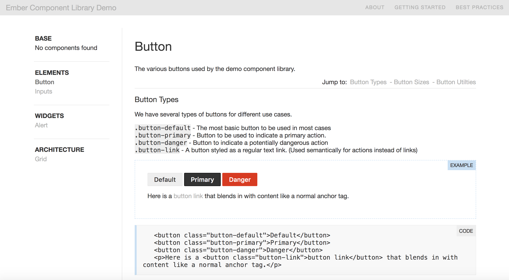

# Ember CSS Docs Prototype

This project serves as a prototype/proof of concept for what an Ember based CSS documentation generator may look and work like. I originally made this a couple of years ago in an older version of Ember. At the time, there were no Ember based CSS documentation systems around, so I threw this together to see how workable it is. 

Since then I've had to upgrade ember-cli, etc. because of a huge amount of npm vulnerabilities when trying to run it again 2 years later. However, I have not updated much else, and there may be bugs now. And there are definitely way better/more efficent ways of redoing this whole thing now with new Ember, and there are still some old, no bueno Ember patterns in here. Same for the CSS. (Aka Please don't judge :) ) I am literally just throwing this up on my Github for reference, and *I do not encourage anyone to actually use this as-is for their CSS documentation, as I will probably never update or maintain this.* 

I used DSS for the comment parsing mechanism, which generates JSON. Ember Mirage, usually used for tests, hooks this up with Ember Data so it can generate the pages and demo blocks as needed. The goal was to automate as much of the site as possible through comments in the CSS files alone.



## Prerequisites

You will need the following things properly installed on your computer.

* [Git](https://git-scm.com/)
* [Node.js](https://nodejs.org/) (with npm)
* [Ember CLI](https://ember-cli.com/)
* [Google Chrome](https://google.com/chrome/)

## Installation

* `git clone <repository-url>` this repository
* `cd component-library`
* `npm install`

## Running / Development

* `ember serve`
* Visit your app at [http://localhost:4200](http://localhost:4200).
* Visit your tests at [http://localhost:4200/tests](http://localhost:4200/tests).

### Generate CSS Data
Every time you make a change to CSS documentation, you need to run this task to
regenerate the data for the app:

```
grunt documentation
```

To view more details in the terminal while this task is processing:
```
grunt --verbose documentation
```

### Code Generators

Make use of the many generators for code, try `ember help generate` for more details

### Running Tests

* `ember test`
* `ember test --server`

### Linting

* `npm run lint:hbs`
* `npm run lint:js`
* `npm run lint:js -- --fix`

### Building

* `ember build` (development)
* `ember build --environment production` (production)

### Deploying

Specify what it takes to deploy your app.

## Further Reading / Useful Links

* [ember.js](https://emberjs.com/)
* [ember-cli](https://ember-cli.com/)
* Development Browser Extensions
  * [ember inspector for chrome](https://chrome.google.com/webstore/detail/ember-inspector/bmdblncegkenkacieihfhpjfppoconhi)
  * [ember inspector for firefox](https://addons.mozilla.org/en-US/firefox/addon/ember-inspector/)
